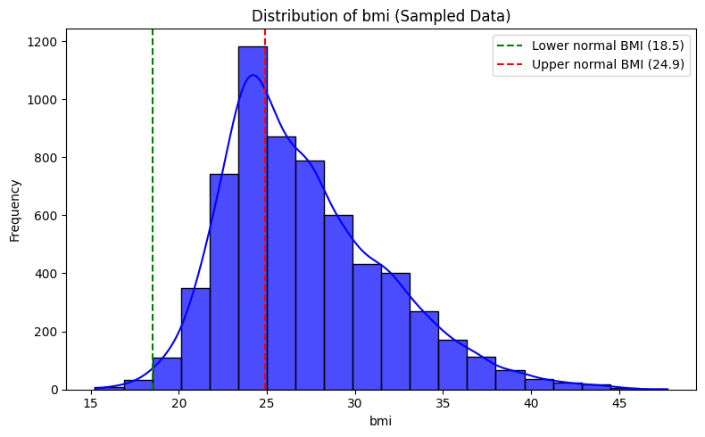

# Cardiovascular Disease Prediction with Apache Spark ML

This repository contains a **Big Data pipeline** project developed for the *Big Data Processing* course. The goal is to predict cardiovascular disease using **Apache Spark ML** and machine learning on large-scale medical data.

---

## Overview
Cardiovascular disease (CVD) accounts for ~13% of global deaths. Early detection is challenging due to complex and large-scale medical data.  
This project demonstrates how **Apache Spark** can be leveraged for scalable data preprocessing, feature engineering, and model training to support **early risk detection** and preventive healthcare.

Three models were implemented:
- **Logistic Regression**
- **Random Forest**
- **Gradient-Boosted Tree (GBTClassifier)**

**Best Result**: Gradient-Boosted Tree with **89.73% accuracy** and **90.31% precision**.

---

## Workflow

  

---

## Methodology
1. **Data Collection**  
   - Dataset: [Cardiovascular Disease Dataset (Kaggle)](https://www.kaggle.com/sulianova/cardiovascular-disease-dataset)  
   - 70,000 patient records (demographics, lifestyle, medical features).

2. **Data Cleaning**  
   - Removed irrelevant columns (`id`), handled missing values, duplicates, outliers (IQR).  
   - Validated categorical values, standardized formats.  
   

     
   

   

     
     
   

3. **Feature Engineering & Selection**  
   - Created new variables: BMI, blood pressure categories, age groups, pressure ratios, cholesterol-BMI interaction, lifestyle impact.  
   - Dropped redundant/low-importance features.  

   

   <table>
     <tr>
       <td></td>
       <td></td>
     </tr>
     <tr>
       <td></td>
       <td></td>
     </tr>
   </table>
   

   

     
   

4. **Preprocessing**  
   - One-Hot Encoding for categorical variables.  
   - StandardScaler for continuous variables.  
   - Train/test split (80:20).  

5. **Model Training & Evaluation**  
   - Models: Logistic Regression, Random Forest, Gradient-Boosted Tree.  
   - Hyperparameter tuning with 2-fold Cross Validation.  
   - Metrics: Accuracy, Precision, Recall, F1-score.  

   

     
     
     
   

   

     
   

---

## Results
- **Gradient-Boosted Tree** → Accuracy **89.73%**, Precision **90.31%**.  
- **Random Forest** → Accuracy **89.52%**, Precision **90.30%**.  
- **Logistic Regression** → Accuracy **89.68%**, Precision **80.46%**.  

All models performed competitively, but GBT showed the most stable and consistent results.

---

## Tools & Libraries
- **Apache Spark MLlib**
- **Python (Google Colab)**
- **Pandas, NumPy, Matplotlib, Seaborn**
- **Scikit-learn** (for evaluation metrics)

---

## How to Run

Since this project was developed in **Google Colab**, you can run it without setting up a local environment:

1. Open [Google Colab](https://colab.research.google.com/)  
2. Click **File > Open notebook > GitHub**  
3. Enter this repository URL: [https://github.com/jazzlynamelia/cardiovascular-prediction/](https://github.com/jazzlynamelia/cardiovascular-prediction/)
4. Select the notebook you want to run (`cardiovascular_prediction.ipynb`)  
5. Run the notebook step by step
